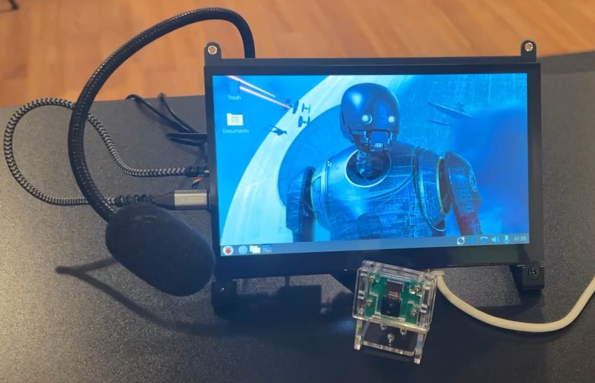
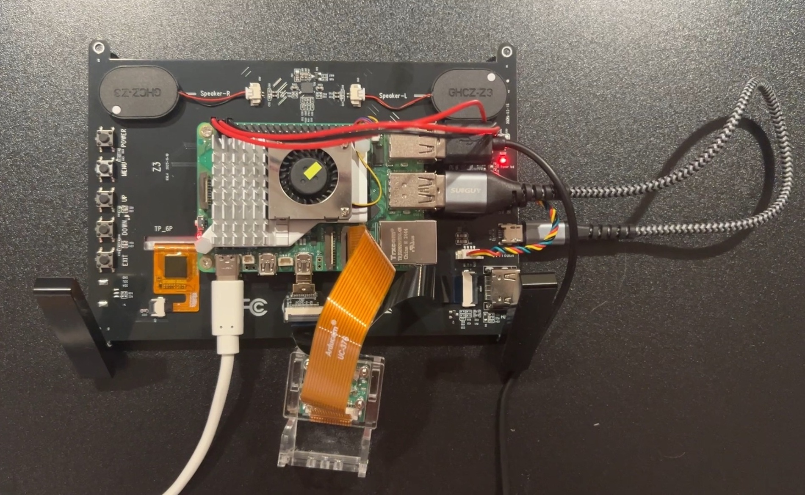

# K-2SO Personal (Droid) Assistant
A fully offline, modular voice assistant designed for the Raspberry Pi and desktop. Inspired by K-2SO from Star Wars: Rogue One.

K-2SO Personal (Droid) Assistant runs quantized Llama models locally, routes commands, and speaks—all without sending your data to the cloud. The architecture is modular: swap in new language models, add custom commands, or plug in your favorite TTS/STT engine. A planned animated face GUI and persistent chat log make it more than just a CLI tool.


*Prototype 1: Front view of the K-2SO assistant interface*


*System architecture diagram for PROTOTYPE K-2SO interface*


*Visual AI indicator with dual animation modes - ripples and frequency bars*

> "I'm with you. The captain said I had to." — K-2SO

### Model Flexibility
K-2SO Personal Droid is designed for maximum flexibility in how you run language models:
- **Run Any Quantized Model Locally:**  
  Use efficient GGUF models (like Llama, TinyLlama, Phi-2, etc.) on your own hardware for full privacy and offline operation.
- **Connect to Any API Model Remotely:**  
  Seamlessly route requests to a remote server, LAN PC, or cloud API—use larger or proprietary models when you need more power.
- **Swap Backends On the Fly:**  
  The assistant's modular architecture lets you switch between local and remote models at runtime, or even route specific commands to different backends.

**Purpose:**  
This project is a robust skeleton for building your own AI assistant—customize the models, commands, and features to fit your workflow. Whether you want a fully offline experience, cloud-powered intelligence, or a hybrid of both, K-2SO makes it easy to experiment and extend.


## Table of Contents

- [Features](#features)
- [Directory Structure](#directory-structure)
- [How It Works](#how-it-works)
- [Setup](#setup)
- [Running the Project](#running-the-project)
- [Pi Setup](#pi-setup)
- [Development Roadmap](#development-roadmap)


## Features

- [x] Local LLM inference (Llama, GGUF)
- [x] Modular command routing
- [ ] Wake-and-listen loop
- [ ] Offline speech-to-text
- [ ] Local text-to-speech
- [ ] Animated GUI (planned)

## Directory Structure

Here's a quick look at how this project is organized:

```plaintext
k2so-personal-assistant/
├── .gitignore                # Standard git ignore rules
├── assets/                   # Images, GIFs, and media for README/docs
├── README.md                 # Project overview and instructions
├── requirements.txt          # Python dependencies (may be empty if using pip install directly)
├── user_config.json          # User-specific config (not required for all setups)
├── src/                      # All main source code lives here
│   ├── main.py               # Entry point for the assistant
│   ├── config.py             # Runtime settings and config logic
│   ├── router.py             # Chooses between local or remote model backends
│   ├── components/           # Core assistant modules
│   │   ├── __init__.py       # Marks components as a package
│   │   ├── local_model.py    # Handles local LLM via llama-cpp-python
│   │   ├── remote_model.py   # Handles remote/LAN/cloud model requests
│   │   ├── chat_session.py   # Manages chat loop and prompt formatting
│   │   └── text_to_speech.py # Text-to-speech logic (pluggable for different TTS engines)
│   └── __init__.py           # Marks src as a package
├── models/                   # Place downloaded GGUF model files here (not tracked by git)
├── .venv-k2so/               # Python virtual environment (not tracked by git)
├── .vscode/                  # VSCode settings (optional, for editor config)
│   └── settings.json         # Editor-specific settings
└── .git/                     # Git version control (auto-managed)
```

## How It Works

- **Startup:**  The assistant launches from `src/main.py`, loading configuration and selecting either a local or remote language model.

- **Core Modules:**
  - `local_model.py`: Runs a quantized Llama model locally using `llama-cpp-python`.
  - `remote_model.py`: Connects to a remote/LAN server for model inference.
  - `chat_session.py`: Manages the conversation loop and context.
  - `text_to_speech.py`: Handles text-to-speech output.

- **Workflow:**
  1. Waits for a trigger (key press, timer, or hotword).
  2. (Planned) Converts speech to text.
  3. Routes input to the appropriate model.
  4. Generates a response.
  5. Speaks the response aloud.
  6. Logs interactions for debugging.

- **Extensibility:**  The modular design makes it easy to add new commands, swap models, or upgrade TTS/STT features.

## Setup

1. Create virtual environment:
```bash
python -m venv .venv-k2so
```

2. Activate the environment (see above for your shell)

3. Install dependencies:
```bash
pip install -r requirements.txt
```

## Running the Project
The project uses a virtual environment named `.venv-k2so`. After setup, you can activate and run the project:

```powershell
# Windows PowerShell
.\.venv-k2so\Scripts\Activate.ps1

# Windows Command Prompt
.\.venv-k2so\Scripts\activate.bat

# Linux/Mac
source .venv-k2so/bin/activate
```

Once activated, run the project from the root directory:
```bash
python src/main.py
```

## Raspberry-Pi Setup
1. Update Raspberry Pi:
```bash
sudo apt update && sudo apt upgrade -y
```
2. Install Python 3 and build tools:
```bash
sudo apt install -y python3 python3-pip python3-venv build-essential
```

3. Create a virtual environment:
```bash
python3 -m venv venv
source venv/bin/activate
```

4. Install Python Packages: WIP
```bash
pip install llama-cpp-python
```

5. Download a Small Quantized Model: WIP
    - Option A: With Hugging Face CLI
    - Option B: Direct Download


## Development Roadmap

### **MVP Features**:
- [ ] basic wake-and-listen loop (triggered by key press, timer, or hotword)
- [ ] offline speech-to-text using microphone input
- [ ] local text-to-speech output
- [ ] simple command routing with keyword-based logic (e.g., time, date, shutdown)
- [ ] response behavior defined in a local module
- [ ] fully offline operation with no cloud services or network dependency
- [ ] console logging of input and output for debugging

### **Planned Features**:
- **Face GUI**: animated AI face with expressions that react to conversation and speech
  * The face should visually indicate when the AI is listening, thinking, or speaking (e.g., mouth movement, eye color changes).
  * Use a simple animated face or waveform circle as a starting point, with potential for more expressive features later.
- **Chat Log**: persistent chat history for each session
  * Store all user and assistant messages locally for each session.
  * Support reviewing or exporting past conversations for context or debugging.
- **Easy Setup Interface**: GUI or executable for first-time setup (API keys, model selection, etc.)
  * Provide a user-friendly interface for configuring model paths, preferences, and hotword settings.
  * Save user preferences in a config directory for easy reloading and updates.
- **Voice Toggle**: flags to enable/disable text-to-speech and speech-to-text
  * Allow users to switch between voice and text modes on the fly.
  * Include adjustable speaking rate and voice settings for TTS, plus an optional hotword detection toggle.
- **Conversational Memory**: maintain context for back-and-forth, multi-turn conversations
  * Implement a message handler pattern for extensible command-response workflows.
  * Use local intent parsing to match natural language input and support contextual follow-ups.
- **Resource/Cost Tracking**: track resource usage (RAM, CPU, model size) and, for remote models, estimate API cost per prompt
  * Display or log resource usage statistics for transparency and optimization.
  * Provide warnings or suggestions if resource usage is high or if a remote model may incur costs.
- **Modular Command Handling**: extend system functions (e.g., weather, file access)
  * Design a plugin-like system for adding new commands or skills easily.
  * Ensure robust error handling and fallback behavior for unsupported or failed commands.
